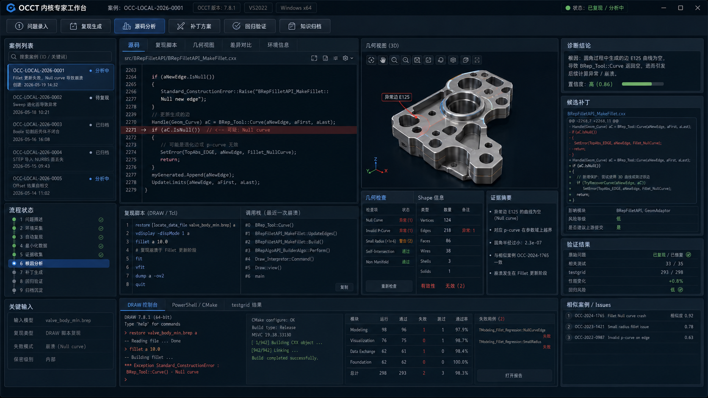

# OCCT 内核专家工作台 UI 设计文档

> 版本：V1.0  
> 适用平台：Windows x64  
> 设计对象：OCCT 内核问题复现、诊断、补丁、验证与知识归档一体化桌面工具  
> 参考概念图：`occt内核专家工作台分析界面.png`



---

## 1. 设计目标

### 1.1 产品定位

**OCCT 内核专家工作台** 是面向几何内核开发人员、CAD/CAM/CAE 企业内核团队、OCCT 二次开发团队的 Windows 桌面工程工具。它的核心目标不是做成普通聊天助手，而是做成一个可落地的 **内核问题工程化闭环平台**：

```text
问题录入 → 环境采集 → 自动复现 → 数据最小化 → 源码分析 → 根因诊断 → 补丁方案 → 回归验证 → 知识归档
```

工具应帮助开发者在一个界面中完成以下工作：

- 管理 OCCT 问题案例。
- 采集复现环境与输入数据。
- 生成 DRAW/Tcl、C++、PowerShell 复现脚本。
- 查看源码、调用栈、日志、几何模型和证据链。
- 检索源码、官方文档、GitHub Issues、历史案例。
- 生成候选补丁并进行人工审核。
- 运行构建、测试、testgrid、testdiff。
- 输出验证报告并沉淀到知识库。

### 1.2 UI 设计原则

本版概念图强调“内核专家工作台”的最终成熟形态，设计原则如下：

| 原则 | 说明 |
|---|---|
| 简洁 | 去掉海报式说明气泡，界面聚焦真实工作流。 |
| 清晰 | 三列主布局、底部控制台、顶部全局操作，信息层级明确。 |
| 实用 | 每个面板都服务于复现、诊断、修复、验证，不做无效装饰。 |
| 高效 | 常用操作一级可达，代码、几何、证据、验证结果同屏联动。 |
| 可追溯 | 所有结论都可回溯到命令、日志、源码、输入数据和测试结果。 |
| 可扩展 | 后续可以增加更多 OCCT 模块诊断器、企业知识库和自动化 Agent。 |

### 1.3 目标用户

| 用户角色 | 主要诉求 |
|---|---|
| OCCT 内核开发者 | 快速复现、定位源码、验证补丁影响。 |
| CAD/CAM/CAE 产品开发者 | 将产品中遇到的几何问题转成最小复现并交给内核团队。 |
| 企业技术负责人 | 跟踪问题状态、评估补丁风险、查看验证报告。 |
| 测试工程师 | 构造回归用例、运行 testgrid、比较测试结果。 |
| 知识库维护者 | 归档案例、维护相似问题、沉淀企业私有经验。 |

---

## 2. 整体信息架构

### 2.1 一级对象

系统围绕以下核心对象设计：

| 对象 | 说明 |
|---|---|
| Case / 案例 | 一个 OCCT 问题单元，包含描述、数据、复现、诊断、补丁、验证、报告。 |
| Workspace / 工作区 | 一个案例对应的本地目录，包含源码、构建目录、日志、数据和结果。 |
| Repro / 复现 | DRAW/Tcl、C++、PowerShell、测试用例等复现资产。 |
| Evidence / 证据 | 日志、调用栈、dump、ASan、checkshape、几何统计、相似 issue。 |
| Diagnosis / 诊断 | 根因假设、证据链、候选源码、置信度和建议动作。 |
| Patch / 补丁 | 候选 diff、修改说明、风险评估、新增测试。 |
| Verification / 验证 | 构建结果、原问题复测、testgrid/testdiff、性能与回归风险。 |
| Knowledge / 知识 | 已归档案例、内部补丁、历史问题、官方/社区相似资料索引。 |
| Report / 报告 | 可导出的 Markdown/HTML/PDF/JSON 结构化结果。 |

### 2.2 主流程状态

每个 Case 都具有明确状态。状态流转应在左侧流程状态面板、顶部状态徽标、案例列表标签中同步展示。

```text
新建
  ↓
问题描述完成
  ↓
环境采集中
  ↓
环境采集完成
  ↓
复现生成中
  ↓
已复现 / 复现失败 / 需要补充信息
  ↓
数据最小化中
  ↓
证据收集中
  ↓
根因分析中
  ↓
待补丁 / 已生成候选补丁
  ↓
验证中
  ↓
验证通过 / 验证失败 / 存在回归风险
  ↓
待审核
  ↓
已归档 / 已关闭 / 已提交上游
```

### 2.3 主界面区域划分

推荐 1920×1080 分辨率下的布局比例：

| 区域 | 建议宽高 | 说明 |
|---|---:|---|
| 顶部标题栏 | 36 px 高 | App 名称、案例编号、环境徽标、状态。 |
| 主工具栏 | 52 px 高 | 问题录入、复现生成、源码分析、补丁方案、回归验证、知识归档。 |
| 左侧案例列 | 300 px 宽 | 案例列表、流程状态、关键输入。 |
| 中央工作区 | 自适应，占 55–60% | 源码、复现脚本、几何视图、证据摘要。 |
| 右侧决策列 | 360–400 px 宽 | 诊断结论、候选补丁、验证结果、相似案例。 |
| 底部控制台 | 210–260 px 高 | DRAW、PowerShell/CMake、testgrid 结果。 |

---

## 3. 顶部区域设计

### 3.1 标题栏

标题栏显示当前应用、案例和环境状态。

#### 元素

| 元素 | 示例 | 说明 |
|---|---|---|
| 应用图标 | 六边形/几何内核图标 | 建议采用简洁蓝色图标。 |
| 应用标题 | `OCCT 内核专家工作台` | 固定显示。 |
| 当前案例 | `案例：OCC-LOCAL-2026-0001` | 点击可打开案例详情。 |
| 环境徽标 | `OCCT 版本 7.8.1`、`VS2022`、`Windows x64` | 展示当前工作区环境。 |
| 状态徽标 | `状态：已复现 / 分析中` | 根据状态改变颜色。 |
| 窗口按钮 | 最小化、最大化、关闭 | Windows 标准行为。 |

#### 状态颜色

| 状态 | 颜色建议 | 含义 |
|---|---|---|
| 未开始 | 灰色 | 尚未执行。 |
| 运行中 | 蓝色 | 正在执行任务。 |
| 成功 | 绿色 | 执行通过。 |
| 警告 | 黄色 | 有风险或信息不足。 |
| 失败 | 红色 | 构建、复现、测试失败。 |
| 待人工 | 紫色 | 需要人工审批或判断。 |

### 3.2 主工具栏

工具栏按钮应保持固定顺序，反映主业务流程。

| 按钮 | 图标建议 | 点击行为 | 快捷键 |
|---|---|---|---|
| 问题录入 | 圆圈数字/表单 | 打开“新建/编辑问题”对话框 | `Ctrl+N` |
| 复现生成 | 脚本/运行 | 打开复现生成向导 | `Ctrl+R` |
| 源码分析 | 柱状图/源码 | 切换到源码分析工作区并启动分析 | `Ctrl+Shift+A` |
| 补丁方案 | 扳手/分支 | 打开候选补丁面板或补丁生成向导 | `Ctrl+P` |
| 回归验证 | 勾选/循环 | 打开验证配置并运行 | `Ctrl+T` |
| 知识归档 | 归档箱 | 打开归档与报告导出界面 | `Ctrl+Shift+S` |

#### 工具栏交互规则

- 当前不可执行的按钮应禁用，而不是隐藏。
- 按钮右侧可提供下拉箭头，展开高级操作。
- 运行中任务对应按钮显示进度小点或 spinner。
- 所有主按钮均支持悬浮说明 tooltip。

---

## 4. 主菜单设计

虽然概念图中以工具栏为主，但真实 Windows 桌面应用建议保留传统菜单栏，支持专家用户通过菜单访问完整功能。

### 4.1 一级菜单结构

```text
文件
案例
复现
分析
补丁
验证
知识库
工具
窗口
帮助
```

### 4.2 文件菜单

```text
文件
├─ 新建案例...                         Ctrl+N
├─ 打开案例...                         Ctrl+O
├─ 打开最近案例
│  ├─ OCC-LOCAL-2026-0001
│  ├─ OCC-LOCAL-2026-0002
│  └─ 清空最近列表
├─ 导入 Repro Pack...
├─ 导入 OCCT Bug 包...
├─ 保存当前案例                         Ctrl+S
├─ 另存为案例模板...
├─ 导出
│  ├─ 导出 Repro Pack...
│  ├─ 导出 Patch Pack...
│  ├─ 导出验证报告...
│  ├─ 导出 Markdown 报告...
│  ├─ 导出 HTML 报告...
│  └─ 导出 JSON Manifest...
├─ 关闭当前案例
├─ 工作区设置...
└─ 退出
```

#### 说明

- “导入 Repro Pack” 用于导入他人打包的问题复现资产。
- “导出 Patch Pack” 包含 diff、测试用例、说明、验证摘要。
- “工作区设置” 配置默认源码路径、构建目录、缓存目录、知识库目录。

### 4.3 案例菜单

```text
案例
├─ 编辑问题描述...
├─ 编辑期望结果...
├─ 添加输入数据...
├─ 添加附件...
├─ 采集环境快照
├─ 标记状态
│  ├─ 待复现
│  ├─ 分析中
│  ├─ 待验证
│  ├─ 待审核
│  ├─ 已归档
│  └─ 已关闭
├─ 设置保密级别
│  ├─ 公开
│  ├─ 内部
│  ├─ 机密
│  └─ 严格禁止外发
├─ 关联上游 Issue...
├─ 关联内部工单...
├─ 复制案例
├─ 删除案例...
└─ 打开案例目录
```

### 4.4 复现菜单

```text
复现
├─ 生成 DRAW 复现脚本...
├─ 生成 C++ 最小复现工程...
├─ 生成 PowerShell 复现脚本...
├─ 运行当前复现                         F5
├─ 停止运行                             Shift+F5
├─ 重跑失败步骤
├─ 数据最小化
│  ├─ 自动最小化...
│  ├─ STEP/XCAF 裁剪...
│  ├─ BREP 子形状裁剪...
│  ├─ C++ 代码最小化...
│  └─ 恢复原始数据
├─ 保存当前几何快照
├─ 生成 tests/bugs 用例...
└─ 打开复现目录
```

### 4.5 分析菜单

```text
分析
├─ 启动源码分析                         Ctrl+Shift+A
├─ 重新索引源码
├─ 查找相关源码文件...
├─ 查找符号...                          Ctrl+Shift+F
├─ 分析调用栈...
├─ 分析崩溃 Dump...
├─ 分析 ASan 报告...
├─ 运行几何检查 checkshape
├─ 运行拓扑统计
├─ 运行相似案例检索
├─ 打开证据链面板
├─ 新建根因假设...
├─ 标记假设为成立
├─ 标记假设为排除
└─ 生成诊断报告草稿
```

### 4.6 补丁菜单

```text
补丁
├─ 生成候选补丁...
├─ 导入外部补丁...
├─ 查看当前 Diff                         Ctrl+D
├─ 应用候选补丁
├─ 回滚候选补丁
├─ 生成回归测试...
├─ 运行 clang-format
├─ 运行静态检查
├─ 设置补丁风险等级
│  ├─ 低
│  ├─ 中
│  └─ 高
├─ 标记为建议提交上游
├─ 生成 Pull Request 草稿...
└─ 导出 Patch Pack...
```

### 4.7 验证菜单

```text
验证
├─ 配置验证矩阵...
├─ 构建当前补丁                         Ctrl+B
├─ 运行原始复现
├─ 运行补丁后复现
├─ 运行相关测试组
├─ 运行 testgrid...
├─ 运行 testdiff...
├─ 运行性能对比...
├─ 运行内存检查...
├─ 查看验证摘要
├─ 查看失败测试
├─ 标记验证通过
├─ 标记验证失败
└─ 导出验证报告...
```

### 4.8 知识库菜单

```text
知识库
├─ 打开知识库浏览器
├─ 搜索相似案例...
├─ 搜索 OCCT 源码...
├─ 搜索官方文档...
├─ 搜索 GitHub Issues...
├─ 搜索内部补丁...
├─ 归档当前案例...
├─ 更新公开知识索引
├─ 更新内部知识索引
├─ 管理标签体系...
├─ 管理脱敏规则...
└─ 知识库设置...
```

### 4.9 工具菜单

```text
工具
├─ DRAWEXE 启动器...
├─ CMake 配置器...
├─ Visual Studio 工具链检测...
├─ Git 工作区管理...
├─ Dump 查看器...
├─ Shape 查看器...
├─ STEP/XCAF 树查看器...
├─ 日志查看器...
├─ 环境变量编辑器...
├─ 插件管理...
└─ 系统设置...
```

### 4.10 窗口菜单

```text
窗口
├─ 重置布局
├─ 保存当前布局...
├─ 加载布局
│  ├─ 标准诊断布局
│  ├─ 复现最小化布局
│  ├─ 补丁审查布局
│  ├─ 验证测试布局
│  └─ 几何查看布局
├─ 显示 / 隐藏面板
│  ├─ 案例列表
│  ├─ 流程状态
│  ├─ 源码编辑器
│  ├─ 几何视图
│  ├─ 证据摘要
│  ├─ 诊断结论
│  ├─ 候选补丁
│  ├─ 验证结果
│  └─ 控制台
├─ 全屏模式                             F11
└─ 禅模式源码查看
```

### 4.11 帮助菜单

```text
帮助
├─ 快速入门
├─ OCCT 问题复现指南
├─ DRAW 脚本参考
├─ 测试与验证说明
├─ 日志与报告说明
├─ 查看快捷键
├─ 打开日志目录
├─ 检查更新
├─ 提交反馈
└─ 关于 OCCT 内核专家工作台
```

---

## 5. 左侧列 UI 设计

左侧列承担“案例管理 + 状态导航 + 输入摘要”的职责，宽度建议 280–320 px。

### 5.1 案例列表面板

#### 结构

```text
案例列表
┌ 搜索案例 ID / 关键词 ┐
├─ OCC-LOCAL-2026-0001    分析中
│  Fillet 更新失败，Null curve 导致崩溃
│  创建：2026-05-19 14:32
├─ OCC-LOCAL-2026-0002    待复现
│  Sweep 退化面导致异常
├─ OCC-LOCAL-2026-0003    已归档
│  Boolean 切割后形状不闭合
└─ ...
```

#### 案例卡片字段

| 字段 | 必填 | 说明 |
|---|---|---|
| Case ID | 是 | 全局唯一 ID。 |
| 标题 | 是 | 简短问题摘要。 |
| 状态 | 是 | 待复现、分析中、待验证、已归档等。 |
| 更新时间 | 是 | 最近一次任务或人工修改时间。 |
| 模块标签 | 否 | Fillet、Boolean、STEP、Mesh、Visualization 等。 |
| 风险标签 | 否 | 崩溃、数据错误、性能退化、回归风险等。 |

#### 操作

- 单击：切换当前案例。
- 双击：打开案例详情页。
- 右键：打开案例上下文菜单。
- 搜索：支持 Case ID、标题、模块、状态、标签。
- 拖拽：支持将数据文件拖入某个案例卡片。

### 5.2 案例右键菜单

```text
打开案例
编辑问题描述...
运行复现
打开案例目录
复制 Case ID
复制 Repro Pack 路径
标记状态
  ├─ 待复现
  ├─ 分析中
  ├─ 待验证
  ├─ 待审核
  └─ 已归档
设置优先级
  ├─ P0 阻塞
  ├─ P1 高
  ├─ P2 中
  └─ P3 低
导出 Repro Pack...
归档案例...
删除案例...
```

### 5.3 流程状态面板

#### 结构

流程状态使用紧凑 stepper 组件。

```text
流程状态
● 1 问题描述        已完成
● 2 环境采集        已完成
● 3 自动复现        已完成
● 4 最小化数据      已完成
● 5 证据收集        已完成
▶ 6 根因分析        进行中
○ 7 补丁生成        未开始
○ 8 回归验证        未开始
○ 9 归档沉淀        未开始
```

#### Step 状态

| 状态 | 图标 | 颜色 | 行为 |
|---|---|---|---|
| 未开始 | 空心圆 | 灰色 | 可点击查看说明。 |
| 进行中 | 播放/蓝点 | 蓝色 | 点击查看实时任务。 |
| 已完成 | 勾选 | 绿色 | 点击查看产物。 |
| 失败 | 叉号 | 红色 | 点击查看错误。 |
| 需要人工 | 感叹号 | 黄色 | 点击打开补充信息对话框。 |
| 被跳过 | 短横线 | 灰色 | 显示跳过原因。 |

### 5.4 关键输入面板

该面板用于快速确认当前案例关键上下文。

```text
关键输入
输入模型      valve_body_min.brep
复现类型      DRAW 脚本复现
失败模式      崩溃 / Null curve
保密级别      内部
```

#### 可点击字段

| 字段 | 点击行为 |
|---|---|
| 输入模型 | 打开数据文件列表。 |
| 复现类型 | 打开复现配置。 |
| 失败模式 | 打开问题描述。 |
| 保密级别 | 打开保密设置。 |

---

## 6. 中央工作区 UI 设计

中央区域是工具核心，应同时支持源码分析、复现脚本、几何视图、证据查看。

### 6.1 顶部标签页

```text
源码 | 复现脚本 | 几何视图 | 差异对比 | 环境信息
```

#### 标签页说明

| 标签 | 主要内容 |
|---|---|
| 源码 | 代码编辑器、符号导航、候选修改点、调用关系。 |
| 复现脚本 | DRAW/Tcl、C++、PowerShell 脚本编辑与运行。 |
| 几何视图 | 3D 模型查看、拓扑选择、shape 检查、差异可视化。 |
| 差异对比 | 补丁前后几何结果、图像结果、测试结果、性能结果对比。 |
| 环境信息 | Windows、MSVC、CMake、OCCT、第三方库、环境变量。 |

#### 标签交互

- `Ctrl+Tab`：切换下一个标签。
- `Ctrl+Shift+Tab`：切换上一个标签。
- 标签可固定、分屏、拖拽成浮动窗口。
- 当前任务相关标签出现小状态点，例如源码分析完成、几何检查失败。

### 6.2 源码编辑器面板

#### 面板结构

```text
src/BRepFilletAPI/BRepFilletAPI_MakeFillet.cxx
┌─────────────────────────────────────────────┐
│ 行号 │ C++ 源码                              │
│ 2268 │ Handle(Geom_Curve) aC = ...          │
│ 2271 │ if (aC.IsNull())    ← 高亮可疑行      │
└─────────────────────────────────────────────┘
```

#### 功能

| 功能 | 说明 |
|---|---|
| 语法高亮 | C++、Tcl、PowerShell、CMake。 |
| 行号与列号 | 支持复制文件路径与行号。 |
| 可疑行高亮 | 根据调用栈、日志、分析结果高亮。 |
| 符号跳转 | 跳转定义、引用、调用方、派生类。 |
| Git 信息 | 显示 blame、最近修改、相关 commit。 |
| 内联证据 | 某行关联日志、dump、issue、test case 时显示标记。 |
| 差异模式 | 展示候选补丁 diff。 |
| 只读/编辑模式 | 默认只读，生成补丁或手动修改时切换编辑。 |

#### 源码编辑器右键菜单

```text
跳转到定义
查找所有引用
查看调用关系
复制文件路径
复制文件路径和行号
在资源管理器中打开
在 Visual Studio 中打开
添加到候选源码文件
添加注释到诊断报告
生成局部补丁建议
查看 Git Blame
查看相关 Commit
查看相似 Issue
```

#### 行标记类型

| 标记 | 说明 |
|---|---|
| 红色背景 | 崩溃点、异常点、失败断言。 |
| 黄色背景 | 可疑逻辑、风险点、容差处理点。 |
| 绿色边栏 | 补丁新增行。 |
| 红色边栏 | 补丁删除行。 |
| 蓝色标记 | 与证据链关联。 |
| 紫色标记 | 与 Agent 假设关联。 |

### 6.3 复现脚本面板

#### 支持脚本类型

| 类型 | 用途 |
|---|---|
| DRAW/Tcl | 几何问题、算法问题、测试用例生成的首选复现。 |
| C++ | API 调用、崩溃、集成场景复现。 |
| PowerShell | 环境、构建、部署、批处理复现。 |
| CMake | 最小复现工程配置。 |
| Python 可选 | 企业内部自动化脚本，不作为核心依赖。 |

#### 面板布局

```text
复现脚本 (DRAW / Tcl)
┌───────────────────────────┐
│ 1 restore valve_body.brep a│
│ 2 vdisplay -dispMode 1 a   │
│ 3 fillet a 10.0            │
│ 4 fit                      │
│ 5 dump a -o v2             │
└───────────────────────────┘
[运行] [单步运行] [停止] [生成测试用例] [打开目录]
```

#### 复现脚本右键菜单

```text
运行当前脚本
从当前行开始运行
仅运行选中行
停止执行
复制命令
插入 DRAW 命令模板
插入 checkshape
插入 screenshot
插入 dump shape
生成 tests/bugs 用例
保存为复现脚本
```

### 6.4 调用栈 / 运行日志面板

#### 调用栈字段

| 字段 | 说明 |
|---|---|
| 序号 | `#0`、`#1` 等。 |
| 函数名 | 当前帧函数。 |
| 文件路径 | 可点击跳转源码。 |
| 行号 | 与源码编辑器联动。 |
| 模块 | TKFillet、TKBool 等。 |
| 置信标记 | 是否是直接崩溃点、上游调用点、用户调用点。 |

#### 日志字段

| 字段 | 说明 |
|---|---|
| 时间 | 日志产生时间。 |
| 级别 | INFO/WARN/ERROR/FATAL。 |
| 来源 | DRAW、CMake、testgrid、Agent、Debugger。 |
| 消息 | 日志内容。 |
| 关联对象 | Case、脚本、文件、shape、测试项。 |

#### 日志右键菜单

```text
复制日志行
复制选中日志
过滤同类日志
定位到源码
定位到复现脚本
添加到证据链
忽略该警告
导出日志...
```

---

## 7. 几何视图 UI 设计

几何视图应服务于工程诊断，而不是单纯展示模型。

### 7.1 3D 视图区

#### 显示内容

- 金属 CAD 零件或导入模型。
- 高亮异常边/面/点。
- 支持拓扑 ID 标签，例如 `异常边 E125`。
- 支持显示坐标轴、包围盒、法向、曲率、容差热力图。
- 支持补丁前/补丁后结果对比。

#### 顶部工具条

```text
选择 | 平移 | 旋转 | 缩放 | 框选 | 适配窗口 | 线框 | 着色 | 透明 | 剖切 | 测量 | 截图 | 导出
```

#### 鼠标操作

| 操作 | 行为 |
|---|---|
| 左键单击 | 选择拓扑对象。 |
| Ctrl + 左键 | 多选。 |
| Shift + 左键 | 选择相关链，例如 wire、face-loop。 |
| 鼠标中键拖动 | 平移。 |
| 右键拖动 | 旋转。 |
| 滚轮 | 缩放。 |
| 双击对象 | 打开 Shape 属性。 |

### 7.2 几何对象右键菜单

```text
查看 Shape 属性
复制拓扑 ID
高亮相关边/面
隔离显示
隐藏对象
显示邻接对象
显示 p-curve
显示 3D curve
显示容差
运行 checkshape
导出选中子形状...
加入最小化保留集
加入异常证据链
```

### 7.3 几何检查面板

#### 检查项

| 检查项 | 状态 | 说明 |
|---|---|---|
| Null Curve | 异常 | Edge 缺少 3D curve。 |
| Invalid P-Curve | 异常 | p-curve 缺失或不合法。 |
| Small Radius | 警告 | 小半径可能导致 fillet/chamfer 失败。 |
| Self-Intersection | 通过 | 自交检查。 |
| Non Manifold | 通过 | 非流形检查。 |
| Degenerated Edge | 警告/通过 | 退化边检查。 |
| SameParameter | 警告/通过 | SameParameter 状态。 |

#### 操作按钮

| 按钮 | 行为 |
|---|---|
| 重新检查 | 重新运行 checkshape 与内部几何检查器。 |
| 导出报告 | 导出几何检查 Markdown/JSON。 |
| 高亮异常 | 在 3D 视图区高亮异常对象。 |
| 生成修复建议 | 针对异常项生成候选 Shape Healing 或源码分析建议。 |

### 7.4 Shape 信息面板

```text
Shape 信息
类型        数量      备注
Vertices    124
Edges       218      异常: 1
Faces        86
Wires        38
Shells        3
Solids        1
有效性       无效(2)
```

#### Shape 信息交互

- 单击 `Edges 异常: 1`：自动过滤异常 edge 并在视图中高亮。
- 双击 `Faces`：打开面列表对话框。
- 右键 `Solids`：导出选中 solid 或进入隔离显示。

### 7.5 差异对比视图

差异对比用于验证补丁前后几何结果。

#### 视图模式

| 模式 | 说明 |
|---|---|
| 并排对比 | 左侧 baseline，右侧 patched。 |
| 叠加对比 | 同一视图中叠加显示，差异高亮。 |
| 拓扑对比 | 对比 vertex/edge/face/shell/solid 结构。 |
| 几何误差 | 显示距离误差、曲率变化、容差变化。 |
| 图像差异 | 对比截图渲染结果。 |

---

## 8. 右侧决策列 UI 设计

右侧列承担“结论、补丁、验证、相似案例”的决策辅助职责。它必须简洁，不应变成聊天窗口。

### 8.1 诊断结论卡片

#### 示例结构

```text
诊断结论
根因：圆角过程中生成的边 E125 曲线为空，导致 BRep_Tool::Curve 返回空，进而引发后续计算异常/崩溃。
置信度：高 (0.86)
证据：日志、调用栈、几何检查、相似案例一致。
```

#### 字段

| 字段 | 说明 |
|---|---|
| 根因摘要 | 1–3 句说明。 |
| 置信度 | 0–1 或低/中/高。 |
| 证据数量 | 引用证据条数。 |
| 当前假设状态 | 未验证、部分验证、已验证、已排除。 |
| 建议动作 | 继续调试、生成补丁、补充数据等。 |

#### 操作

| 按钮 | 行为 |
|---|---|
| 查看证据链 | 打开完整证据链视图。 |
| 编辑结论 | 允许人工修改诊断结论。 |
| 生成报告段落 | 将结论写入报告草稿。 |

### 8.2 候选补丁卡片

#### 示例结构

```text
候选补丁
BRepFilletAPI_MakeFillet.cxx
@@ -2268,7 +2268,11 @@
- if (aC.IsNull())
+ if (aC.IsNull()) {
+   SetError(TopAbs_EDGE, aNewEdge, Fillet_NullCurve);
+   return;
+ }

影响模块：BRepFilletAPI, GeomAdaptor
风险等级：低
是否建议上游提交：是
```

#### 字段

| 字段 | 说明 |
|---|---|
| 补丁编号 | Patch-001、Patch-002。 |
| 修改文件 | 一个或多个源码文件。 |
| diff 摘要 | 仅展示关键行，完整 diff 在弹窗中查看。 |
| 影响模块 | TKFillet、TKBool、TKSTEP 等。 |
| 风险等级 | 低/中/高。 |
| 兼容性 | 是否修改 API、ABI、行为。 |
| 测试要求 | 必须通过的测试集。 |
| 上游建议 | 是否建议提交官方 upstream。 |

#### 操作按钮

| 按钮 | 行为 |
|---|---|
| 查看完整 Diff | 打开 Patch Review 对话框。 |
| 应用补丁 | 将候选补丁应用到源码工作区。 |
| 回滚补丁 | 回滚当前应用补丁。 |
| 生成更多 | 生成新的候选方案。 |
| 标记废弃 | 关闭该候选补丁。 |

### 8.3 验证结果卡片

#### 示例结构

```text
验证结果
原始问题       已复现 / 已修复
相关测试       33 / 35
testgrid       293 / 298
性能变化       +0.8%
回归风险       低
```

#### 字段说明

| 字段 | 含义 |
|---|---|
| 原始问题 | baseline 是否能失败、patched 是否能修复。 |
| 相关测试 | 按模块筛选出的测试通过率。 |
| testgrid | 当前测试网格总体结果。 |
| 性能变化 | 相对 baseline 的时间或内存变化。 |
| 回归风险 | 基于失败数、性能变化、修改范围综合评估。 |

#### 操作按钮

```text
查看详情
重跑验证
导出验证报告
打开失败用例
```

### 8.4 相似案例 / Issues 卡片

#### 示例结构

```text
相似案例 / Issues
1  OCC-2024-1765  Fillet Null curve crash       相似度 0.92
2  OCC-2023-1421  Small radius fillet issue     相似度 0.78
3  OCC-2022-0987  Invalid p-curve on edge       相似度 0.63
```

#### 交互

- 单击条目：打开详情预览。
- 双击条目：打开知识库详情页。
- 右键：复制链接、加入证据链、标记为相关/不相关。

---

## 9. 底部控制台 UI 设计

底部控制台是执行透明度的核心，不能隐藏自动化过程。

### 9.1 标签页

```text
DRAW 控制台 | PowerShell / CMake | testgrid 结果
```

### 9.2 DRAW 控制台

#### 功能

- 显示 DRAWEXE 启动信息。
- 支持交互式输入 DRAW 命令。
- 支持从复现脚本中逐行执行。
- 支持命令历史、自动补全、错误跳转。

#### 右键菜单

```text
复制
粘贴
清空控制台
重新运行上一条命令
保存输出...
插入到复现脚本
添加到证据链
打开 DRAW 命令帮助
```

### 9.3 PowerShell / CMake 控制台

#### 功能

- 运行 CMake 配置、构建、安装、ctest。
- 展示 MSBuild/Ninja 输出。
- 解析编译错误并跳转源码。
- 自动记录命令到执行日志。

#### 推荐内容摘要

```text
CMake configure: OK
Build type: Release
MSVC 19.38.33130
[942/942] Linking ...
Build completed successfully.
```

### 9.4 testgrid 结果面板

#### 表格字段

| 字段 | 说明 |
|---|---|
| 模块 | Modeling、Visualization、Data Exchange 等。 |
| 运行 | 测试用例数量。 |
| 通过 | 通过数量。 |
| 失败 | 失败数量。 |
| 跳过 | 跳过数量。 |
| 通过率 | 百分比。 |
| 耗时 | 总耗时。 |
| 变化 | 相比 baseline 的性能变化。 |

#### 右键菜单

```text
打开失败用例
重跑该模块
查看日志
查看截图差异
加入验证报告
标记为已知失败
导出 JUnit XML
导出 HTML 报告
```

---

## 10. 关键对话框设计

本节列出主要对话框和向导。所有对话框应遵循一致结构：标题、说明、主体表单、校验区、底部操作按钮。

### 10.1 新建 / 编辑问题对话框

#### 触发入口

- 工具栏：`问题录入`
- 菜单：`文件 → 新建案例...`
- 快捷键：`Ctrl+N`

#### 对话框结构

```text
新建问题案例
├─ 基本信息
├─ 问题描述
├─ 输入数据
├─ 期望结果
├─ 环境信息
├─ 保密设置
└─ 创建确认
```

#### 字段

| 分组 | 字段 | 类型 | 必填 | 说明 |
|---|---|---|---|---|
| 基本信息 | 案例标题 | 单行输入 | 是 | 简短描述问题。 |
| 基本信息 | 模块类型 | 下拉 | 是 | Fillet、Boolean、STEP、Mesh 等。 |
| 基本信息 | 严重程度 | 下拉 | 是 | P0/P1/P2/P3。 |
| 问题描述 | 现象描述 | 多行文本 | 是 | 实际失败表现。 |
| 问题描述 | 期望行为 | 多行文本 | 是 | 正确结果应该是什么。 |
| 问题描述 | 是否稳定复现 | 单选 | 是 | 是/否/未知。 |
| 输入数据 | CAD 文件 | 文件列表 | 否 | STEP、BREP、IGES、XBF 等。 |
| 输入数据 | 原始代码片段 | 文本/文件 | 否 | C++/DRAW/脚本。 |
| 输入数据 | 截图/视频 | 文件列表 | 否 | 可视化问题需要。 |
| 环境信息 | OCCT 版本 | 输入/自动识别 | 否 | 可后续采集。 |
| 环境信息 | 编译器 | 输入/自动识别 | 否 | VS2019/VS2022 等。 |
| 保密设置 | 保密级别 | 下拉 | 是 | 公开/内部/机密/禁止外发。 |
| 保密设置 | 允许联网检索 | 开关 | 是 | 默认取决于保密级别。 |

#### 按钮

```text
取消 | 保存草稿 | 创建案例 | 创建并采集环境
```

#### 校验规则

- 标题不能为空。
- 至少填写“现象描述”或上传一个复现文件。
- 如果保密级别为“禁止外发”，则自动关闭联网检索和外部模型调用。
- 如果上传文件超过设定大小，提示是否进入数据裁剪流程。

### 10.2 环境采集对话框

#### 触发入口

- 工具栏：问题录入后自动触发。
- 菜单：`案例 → 采集环境快照`

#### 内容

```text
环境采集
├─ Windows 信息
├─ Visual Studio / MSVC
├─ CMake / Ninja / MSBuild
├─ OCCT 源码与构建目录
├─ 第三方库路径
├─ 环境变量
├─ Git 状态
└─ 采集结果
```

#### 字段与检查项

| 检查项 | 状态 | 说明 |
|---|---|---|
| Windows x64 | 通过/失败 | 系统架构。 |
| Visual Studio | 通过/失败 | 检测 VS 安装和 MSVC 版本。 |
| CMake | 通过/失败 | 检测 cmake 可执行文件。 |
| Ninja/MSBuild | 通过/失败 | 构建工具。 |
| OCCT 源码路径 | 通过/失败 | 是否存在源码目录。 |
| Git clean 状态 | 警告/通过 | 是否有未提交修改。 |
| CASROOT | 警告/通过 | 环境变量是否正确。 |
| 第三方库 | 警告/通过 | Tcl/Tk、FreeType、TBB 等。 |

#### 按钮

```text
重新扫描 | 手动选择路径 | 保存环境快照 | 继续复现生成
```

### 10.3 数据导入与脱敏对话框

#### 触发入口

- 新建问题时上传数据。
- 菜单：`案例 → 添加输入数据...`
- 几何视图右键：`导出选中子形状...`

#### 功能

- 导入 STEP/BREP/IGES/STL/XBF/ZIP。
- 计算 hash 和文件大小。
- 检查是否包含敏感名称、层、颜色、PMI、装配树。
- 执行脱敏、裁剪、重命名、子形状导出。

#### 字段

| 字段 | 类型 | 说明 |
|---|---|---|
| 文件列表 | 表格 | 文件名、类型、大小、hash、状态。 |
| 解析方式 | 下拉 | 普通 Shape、XCAF 装配、Mesh、未知。 |
| 脱敏策略 | 多选 | 删除名称、删除颜色、删除 PMI、重命名 label、裁剪子形状。 |
| 输出目录 | 路径选择 | 生成脱敏文件的位置。 |

#### 按钮

```text
添加文件 | 移除 | 扫描敏感信息 | 执行脱敏 | 导入并继续
```

### 10.4 复现生成向导

#### 触发入口

- 工具栏：`复现生成`
- 菜单：`复现 → 生成 DRAW 复现脚本...`

#### 步骤

```text
1. 选择复现类型
2. 选择输入数据
3. 配置操作参数
4. 生成脚本
5. 运行验证
6. 保存 Repro Pack
```

#### 复现类型

| 类型 | 使用场景 |
|---|---|
| DRAW/Tcl | 几何算法和 OCCT 官方测试风格。 |
| C++ 最小工程 | API 级别问题、崩溃、生命周期问题。 |
| PowerShell | 构建、部署、环境变量、DLL 问题。 |
| 混合复现 | 同时生成 DRAW + C++ + 命令脚本。 |

#### 操作参数示例

| 模块 | 参数 |
|---|---|
| Fillet/Chamfer | edge id、radius、distance、mode、tolerance。 |
| Boolean | operation、argument shape、tool shape、parallel、fuzzy value。 |
| STEP/XCAF | import mode、单位、颜色、装配、PMI。 |
| Mesh | deflection、angle、parallel、relative。 |
| Visualization | display mode、camera、selection mode、GPU 参数。 |

#### 按钮

```text
上一步 | 下一步 | 生成脚本 | 运行复现 | 保存
```

### 10.5 最小化数据对话框

#### 触发入口

- 菜单：`复现 → 数据最小化 → 自动最小化...`
- 流程状态：点击“最小化数据”步骤。

#### 目标

将大模型、大工程、大脚本逐步缩减为仍能稳定复现问题的最小数据集。

#### 策略选项

| 策略 | 说明 |
|---|---|
| 保留异常对象邻域 | 仅保留异常 edge/face 周边拓扑。 |
| 子形状二分裁剪 | 使用 delta debugging 删除无关子形状。 |
| 装配树裁剪 | 对 STEP/XCAF 装配按 label 删除。 |
| 参数缩减 | 自动缩小半径、容差、操作参数范围。 |
| 代码最小化 | 删除与崩溃无关的 C++ 代码段。 |

#### UI 字段

| 字段 | 类型 | 说明 |
|---|---|---|
| 最小化目标 | 多选 | 文件大小、拓扑数量、脚本行数、运行时间。 |
| 保留对象 | 列表 | 必须保留的 edge/face/solid。 |
| 最大迭代次数 | 数字 | 默认 50。 |
| 每次运行超时 | 数字 | 默认 60 秒。 |
| 判定条件 | 表达式/模板 | 例如“仍然崩溃”“仍然返回 Null curve”。 |

#### 按钮

```text
开始最小化 | 暂停 | 停止 | 恢复原始数据 | 保存最小复现
```

### 10.6 构建配置对话框

#### 触发入口

- 菜单：`工具 → CMake 配置器...`
- 验证前自动弹出。

#### 内容

```text
构建配置
├─ 源码路径
├─ 构建目录
├─ 构建类型
├─ 生成器
├─ 第三方库
├─ 编译选项
└─ 预设管理
```

#### 字段

| 字段 | 类型 | 示例 |
|---|---|---|
| 源码路径 | 路径 | `D:\occt\src` |
| 构建目录 | 路径 | `D:\occt\build\vs2022` |
| 生成器 | 下拉 | Visual Studio 17 2022 / Ninja |
| 平台 | 下拉 | x64 |
| 构建类型 | 下拉 | Debug / Release / RelWithDebInfo / ASan |
| 安装目录 | 路径 | `D:\occt\install` |
| 并行数 | 数字 | 16 |
| 使用缓存 | 开关 | 开/关 |
| 清理构建 | 开关 | 开/关 |

#### 按钮

```text
检测工具链 | 生成 CMake 命令 | 配置 | 构建 | 保存为预设
```

### 10.7 调试与 Dump 设置对话框

#### 触发入口

- 菜单：`分析 → 分析崩溃 Dump...`
- 菜单：`工具 → Dump 查看器...`

#### 配置项

| 配置 | 说明 |
|---|---|
| 自动生成 dump | 崩溃时保存 mini/full dump。 |
| 调试器 | Visual Studio / cdb / WinDbg。 |
| 符号路径 | PDB 搜索路径。 |
| 源码映射 | dump 中路径与本地源码路径映射。 |
| 异常过滤 | access violation、Standard_Failure、assert 等。 |
| 断点配置 | 函数名、文件行、异常类型。 |

#### 按钮

```text
加载 Dump | 解析调用栈 | 定位源码 | 保存证据 | 关闭
```

### 10.8 根因分析任务配置对话框

#### 触发入口

- 工具栏：`源码分析`
- 菜单：`分析 → 启动源码分析`

#### 选项

| 选项 | 说明 |
|---|---|
| 分析范围 | 当前调用栈、当前 toolkit、全源码。 |
| 检索范围 | 源码、文档、GitHub Issues、内部知识库。 |
| 证据类型 | 日志、dump、ASan、checkshape、测试结果。 |
| 输出格式 | 假设列表、候选源码、诊断报告草稿。 |
| 最大耗时 | 限制分析任务执行时间。 |

#### 按钮

```text
开始分析 | 保存配置 | 取消
```

### 10.9 知识检索对话框

#### 触发入口

- 菜单：`知识库 → 搜索相似案例...`
- 相似案例卡片点击“查看更多”。

#### 搜索字段

| 字段 | 类型 | 说明 |
|---|---|---|
| 查询词 | 输入 | 支持自然语言、函数名、错误消息。 |
| 模块 | 多选 | TKFillet、TKBool、TKSTEP 等。 |
| 问题类型 | 多选 | 崩溃、错误几何、性能、导入导出。 |
| 来源 | 多选 | 源码、官方文档、GitHub、内部案例。 |
| 版本范围 | 区间 | OCCT 7.4–8.0。 |
| 相似度阈值 | 滑条 | 默认 0.6。 |

#### 结果字段

| 字段 | 说明 |
|---|---|
| 标题 | Issue/案例/测试名。 |
| 来源 | GitHub、内部、官方 tests。 |
| 相似度 | 0–1。 |
| 关联符号 | 函数、类、文件。 |
| 处理状态 | 已修复、未修复、未知。 |

### 10.10 Patch Review 对话框

#### 触发入口

- 右侧候选补丁卡片：`查看完整 Diff`
- 菜单：`补丁 → 查看当前 Diff`

#### 布局

```text
Patch Review
├─ 左侧：修改文件列表
├─ 中央：diff 查看器
├─ 右侧：风险、测试、评论
└─ 底部：操作按钮
```

#### 文件列表字段

| 字段 | 说明 |
|---|---|
| 文件路径 | 修改文件。 |
| 增加行数 | 新增代码行。 |
| 删除行数 | 删除代码行。 |
| 模块 | 影响 toolkit。 |
| 风险 | 低/中/高。 |

#### 操作按钮

```text
应用补丁 | 回滚补丁 | 编辑补丁 | 运行格式化 | 生成测试 | 进入验证
```

#### 审查标记

| 标记 | 含义 |
|---|---|
| 必须修改 | 人工要求继续修改。 |
| 可以接受 | 当前修改可进入验证。 |
| 需要更多测试 | 需要补充测试覆盖。 |
| 不建议合并 | 风险过高或方向错误。 |

### 10.11 补丁生成策略对话框

#### 触发入口

- 工具栏：`补丁方案`
- 菜单：`补丁 → 生成候选补丁...`

#### 策略字段

| 字段 | 类型 | 说明 |
|---|---|---|
| 修复目标 | 单选/多选 | 崩溃保护、错误几何、性能、导入导出。 |
| 修改范围 | 下拉 | 单函数、单文件、单 package、跨模块。 |
| 风险偏好 | 下拉 | 保守、平衡、激进。 |
| 是否允许 API 修改 | 开关 | 默认关闭。 |
| 是否必须生成测试 | 开关 | 默认开启。 |
| 是否运行格式化 | 开关 | 默认开启。 |
| 最大候选数 | 数字 | 默认 3。 |

#### 按钮

```text
生成候选补丁 | 只生成修复建议 | 取消
```

### 10.12 回归验证配置对话框

#### 触发入口

- 工具栏：`回归验证`
- 菜单：`验证 → 配置验证矩阵...`

#### 配置项

| 配置 | 说明 |
|---|---|
| 构建类型 | Debug、Release、RelWithDebInfo、ASan。 |
| 必跑项 | 原始复现、新增测试、相关测试组。 |
| 可选项 | 全量 testgrid、性能测试、图像差异。 |
| 测试组 | Modeling、Fillet、Boolean、Data Exchange 等。 |
| 超时设置 | 单用例/总任务超时。 |
| 并行数 | testgrid 并行执行数。 |
| 失败策略 | 首个失败停止、继续执行、仅重跑失败。 |
| baseline | 当前版本、上一次成功、指定 commit。 |

#### 按钮

```text
保存配置 | 开始验证 | 仅生成命令 | 取消
```

### 10.13 测试失败详情对话框

#### 触发入口

- testgrid 表格中双击失败项。
- 验证结果卡片点击“查看详情”。

#### 内容

```text
失败测试详情
├─ 测试名称
├─ 运行命令
├─ 失败日志
├─ 期望结果
├─ 实际结果
├─ 截图差异
├─ 相关源码
└─ 操作建议
```

#### 操作按钮

```text
重跑该测试 | 打开日志 | 打开截图 | 加入报告 | 标记为已知失败
```

### 10.14 报告导出对话框

#### 触发入口

- 工具栏：`知识归档`
- 菜单：`文件 → 导出 → 导出验证报告...`

#### 导出内容

| 内容 | 默认 | 说明 |
|---|---|---|
| 问题摘要 | 是 | 标题、现象、期望。 |
| 环境信息 | 是 | Windows、OCCT、编译器。 |
| 输入数据清单 | 是 | 文件 hash、大小、脱敏状态。 |
| 复现步骤 | 是 | DRAW/C++/PowerShell。 |
| 证据链 | 是 | 日志、调用栈、几何检查。 |
| 诊断结论 | 是 | 根因假设和置信度。 |
| 补丁说明 | 是 | 修改内容、风险。 |
| 验证结果 | 是 | testgrid/testdiff。 |
| 附件 | 可选 | 图片、dump、模型数据。 |

#### 格式

```text
Markdown
HTML
PDF
JSON Manifest
ZIP Repro Pack
ZIP Patch Pack
```

### 10.15 知识归档对话框

#### 触发入口

- 工具栏：`知识归档`
- 菜单：`知识库 → 归档当前案例...`

#### 字段

| 字段 | 类型 | 说明 |
|---|---|---|
| 归档标题 | 输入 | 默认使用案例标题。 |
| 问题类型 | 多选 | 崩溃、错误几何、性能等。 |
| OCCT 模块 | 多选 | TKFillet、TKBool 等。 |
| 相关符号 | 标签输入 | 类、函数、文件。 |
| 根因摘要 | 多行文本 | 可从诊断结论自动填充。 |
| 修复摘要 | 多行文本 | 可从补丁说明自动填充。 |
| 可复用程度 | 下拉 | 高/中/低。 |
| 是否允许公开 | 开关 | 默认按保密级别决定。 |
| 关联案例 | 列表 | 上游 issue、内部工单。 |

#### 按钮

```text
保存到知识库 | 保存并生成报告 | 取消
```

### 10.16 系统设置对话框

#### 一级设置页

```text
通用
工作区
OCCT 源码
构建工具链
复现执行
调试与 Dump
知识库
联网与隐私
外观
插件
快捷键
```

#### 重要设置项

| 页面 | 设置项 |
|---|---|
| 通用 | 默认语言、启动时打开最近案例、自动保存间隔。 |
| 工作区 | 默认案例目录、构建目录、缓存目录、归档目录。 |
| OCCT 源码 | 默认源码路径、fork 仓库、分支策略、Git worktree 策略。 |
| 构建工具链 | VS 路径、CMake 路径、Ninja/MSBuild、并行数。 |
| 复现执行 | DRAWEXE 路径、默认超时、脚本模板。 |
| 调试与 Dump | dump 类型、符号路径、调试器路径。 |
| 知识库 | 内部知识库路径、索引刷新周期、相似度阈值。 |
| 联网与隐私 | 是否允许联网检索、敏感数据外发规则、脱敏策略。 |
| 外观 | 深色/浅色、字体、字号、代码主题。 |
| 插件 | 插件启用/禁用、插件目录、插件权限。 |
| 快捷键 | 快捷键查看与自定义。 |

---

## 11. 右键菜单汇总

### 11.1 案例卡片右键菜单

```text
打开案例
编辑案例
运行复现
打开工作区目录
导出 Repro Pack
复制 Case ID
标记状态
设置优先级
归档案例
删除案例
```

### 11.2 源码编辑器右键菜单

```text
跳转到定义
查找引用
查看调用关系
复制路径
复制路径和行号
添加到证据链
添加为候选修改点
生成局部修复建议
查看 Git Blame
在 Visual Studio 中打开
```

### 11.3 几何对象右键菜单

```text
查看属性
复制拓扑 ID
隔离显示
显示邻接对象
显示 p-curve
显示 3D curve
显示容差
运行 checkshape
导出子形状
加入异常证据链
加入最小化保留集
```

### 11.4 日志行右键菜单

```text
复制
过滤同类日志
跳转源码
跳转脚本
添加到证据链
标记为关键错误
导出日志
```

### 11.5 Patch Diff 右键菜单

```text
复制 Diff
打开文件
应用该文件修改
回滚该文件修改
添加审查评论
标记为高风险
生成针对性测试
```

### 11.6 testgrid 结果右键菜单

```text
打开测试用例
重跑测试
查看日志
查看图像差异
加入验证报告
标记为已知失败
导出结果
```

---

## 12. 状态、通知与任务中心

### 12.1 任务类型

| 任务 | 显示位置 |
|---|---|
| 环境采集 | 顶部状态、流程状态、任务中心。 |
| 源码索引 | 顶部状态、右下通知。 |
| 复现运行 | 底部控制台、流程状态。 |
| 数据最小化 | 流程状态、任务中心进度条。 |
| 构建 | PowerShell/CMake 控制台。 |
| 测试 | testgrid 面板。 |
| 补丁生成 | 右侧候选补丁卡片。 |
| 报告导出 | 通知中心。 |

### 12.2 通知类型

| 类型 | 示例 |
|---|---|
| 成功 | `复现已稳定触发，耗时 1.23s。` |
| 警告 | `当前输入数据未脱敏，禁止外部检索。` |
| 失败 | `构建失败：BRepFilletAPI_MakeFillet.cxx 第 2271 行。` |
| 需要人工 | `无法确定期望结果，请补充操作参数。` |
| 后台任务 | `源码索引完成，新增 124 个符号。` |

### 12.3 任务中心对话框

```text
任务中心
├─ 正在运行
│  ├─ testgrid: 37%
│  └─ 源码索引: 82%
├─ 最近完成
│  ├─ 环境采集 成功
│  └─ DRAW 复现 成功
└─ 失败任务
   └─ Release 构建失败
```

#### 操作

```text
暂停 | 取消 | 查看日志 | 重试 | 清空已完成
```

---

## 13. 快捷键设计

| 快捷键 | 操作 |
|---|---|
| `Ctrl+N` | 新建案例。 |
| `Ctrl+O` | 打开案例。 |
| `Ctrl+S` | 保存当前案例。 |
| `Ctrl+R` | 生成/运行复现。 |
| `F5` | 运行当前复现。 |
| `Shift+F5` | 停止运行。 |
| `Ctrl+B` | 构建当前工作区。 |
| `Ctrl+T` | 运行验证。 |
| `Ctrl+D` | 查看当前 diff。 |
| `Ctrl+Shift+A` | 启动源码分析。 |
| `Ctrl+Shift+F` | 全局搜索符号/案例/知识。 |
| `Ctrl+Tab` | 切换标签页。 |
| `F11` | 全屏。 |
| `Ctrl+`` | 聚焦底部控制台。 |
| `Esc` | 关闭浮层/取消选择。 |

---

## 14. 数据结构与界面字段映射

### 14.1 Case Manifest 示例

```yaml
case_id: OCC-LOCAL-2026-0001
title: Fillet 更新失败，Null curve 导致崩溃
status: analyzing
priority: P1
module: Fillet
created_at: 2026-05-19 14:32
updated_at: 2026-05-19 15:20
confidentiality: internal
occt:
  version: 7.8.1
  commit: abcdef1234
  build_type: RelWithDebInfo
  compiler: VS2022
inputs:
  model: valve_body_min.brep
  repro_type: DRAW
failure:
  mode: crash
  message: BRep_Tool::Curve() - Null curve
  deterministic: true
workflow:
  current_step: root_cause_analysis
```

### 14.2 UI 字段映射

| Manifest 字段 | UI 位置 |
|---|---|
| `case_id` | 顶部标题栏、案例列表。 |
| `title` | 案例列表、问题详情。 |
| `status` | 顶部状态徽标、案例卡片、流程状态。 |
| `module` | 案例卡片、诊断结论、补丁影响模块。 |
| `confidentiality` | 关键输入、保密设置、知识归档。 |
| `occt.version` | 顶部环境徽标、环境信息页。 |
| `inputs.model` | 关键输入、几何视图、复现脚本。 |
| `failure.message` | 日志、诊断结论、证据摘要。 |
| `workflow.current_step` | 流程状态面板。 |

---

## 15. 典型用户流程

### 15.1 从问题录入到复现成功

```text
1. 用户点击“问题录入”。
2. 填写标题、现象、期望，上传 BREP/STEP 与原始代码。
3. 系统采集环境快照。
4. 用户点击“复现生成”。
5. 系统生成 DRAW/Tcl 和 C++ 复现脚本。
6. 用户点击“运行复现”。
7. 底部 DRAW 控制台输出运行日志。
8. 如果崩溃或错误稳定出现，流程进入“证据收集”。
```

### 15.2 从复现到根因分析

```text
1. 系统解析日志、调用栈和 dump。
2. 源码编辑器自动打开候选文件。
3. 可疑行被高亮。
4. 几何视图高亮异常 edge/face。
5. 证据摘要列出 Null curve、Invalid p-curve、相似 issue。
6. 右侧“诊断结论”生成根因假设和置信度。
7. 用户可人工确认、修改或排除假设。
```

### 15.3 从补丁生成到回归验证

```text
1. 用户点击“补丁方案”。
2. 打开补丁生成策略对话框。
3. 系统生成候选 diff 和回归测试。
4. 用户在 Patch Review 中审查补丁。
5. 点击“应用补丁”。
6. 点击“回归验证”。
7. 系统执行构建、原复现、相关测试、testgrid/testdiff。
8. 右侧“验证结果”显示通过率、性能变化、回归风险。
```

### 15.4 从验证通过到知识归档

```text
1. 验证结果满足阈值。
2. 用户点击“知识归档”。
3. 系统生成报告草稿。
4. 用户确认标题、标签、保密级别、可复用摘要。
5. 系统归档 Repro Pack、Patch Pack、验证报告。
6. 案例状态变为“已归档”。
```

---

## 16. 空状态、异常状态与错误处理

### 16.1 空状态

| 页面 | 空状态文案 | 操作 |
|---|---|---|
| 案例列表为空 | 暂无案例，创建第一个 OCCT 问题案例。 | 新建案例、导入 Repro Pack。 |
| 源码未配置 | 尚未配置 OCCT 源码路径。 | 打开源码设置。 |
| 几何视图无模型 | 当前案例未加载几何数据。 | 添加输入数据。 |
| 无相似案例 | 未找到相似案例，可扩大检索范围。 | 修改检索条件。 |
| 无补丁 | 当前尚未生成候选补丁。 | 生成补丁方案。 |

### 16.2 错误状态

| 错误 | UI 表现 | 建议操作 |
|---|---|---|
| 构建失败 | 顶部状态红色、底部日志跳转 | 查看错误、定位源码、重试构建。 |
| 复现失败 | 流程状态黄色/红色 | 补充数据、编辑脚本、调整参数。 |
| 数据文件损坏 | 输入数据表红色标记 | 重新上传或尝试修复。 |
| 无权限访问路径 | 系统通知 + 对话框 | 选择新路径或提升权限。 |
| 外部检索被禁止 | 知识检索范围灰掉 | 修改保密级别或使用内部库。 |
| 测试超时 | testgrid 项黄色/红色 | 增加超时、单独调试、标记性能问题。 |

---

## 17. 视觉设计规范

### 17.1 主题

推荐默认深色主题，适合长时间代码与几何调试。

| 设计项 | 建议 |
|---|---|
| 背景 | 深蓝黑 / 深灰。 |
| 面板 | 略浅深色，边框细线。 |
| 主色 | 蓝色，用于当前选中和主要操作。 |
| 成功 | 绿色。 |
| 警告 | 黄色/橙色。 |
| 错误 | 红色。 |
| 需要人工 | 紫色。 |
| 文本 | 主文本高对比，次级文本降低亮度。 |

### 17.2 字体

| 场景 | 字体建议 |
|---|---|
| 中文 UI | Microsoft YaHei UI / Segoe UI。 |
| 代码 | Cascadia Code / Consolas。 |
| 数字指标 | Segoe UI Semibold。 |

### 17.3 间距

| 元素 | 建议 |
|---|---|
| 面板内边距 | 12–16 px。 |
| 控件间距 | 8 px。 |
| 卡片间距 | 10–12 px。 |
| 工具栏按钮高度 | 36–40 px。 |
| 表格行高 | 28–32 px。 |

### 17.4 图标

- 图标以线性图标为主，减少填充大图标。
- 图标必须配合文字，不依赖图标猜含义。
- 高危操作，如删除、回滚、关闭，应使用明确红色提示。

---

## 18. 可访问性与易用性

| 要求 | 说明 |
|---|---|
| 高对比 | 深色主题下保证文本可读。 |
| 键盘可达 | 主功能均支持快捷键和 Tab 导航。 |
| Tooltip | 所有图标按钮提供说明。 |
| 可复制 | 所有路径、命令、错误信息可复制。 |
| 可跳转 | 日志、调用栈、测试失败应能跳转到源码或脚本。 |
| 防误操作 | 删除、回滚、覆盖补丁需二次确认。 |
| 自动保存 | 编辑问题描述、脚本、报告草稿自动保存。 |
| 布局记忆 | 记录用户面板布局和列宽。 |

---

## 19. 权限与保密 UI

### 19.1 保密级别

| 级别 | UI 表现 | 默认行为 |
|---|---|---|
| 公开 | 绿色/普通 | 可联网检索、可生成上游报告。 |
| 内部 | 蓝色 | 可用内部知识库，联网需确认。 |
| 机密 | 黄色 | 禁止外发数据，仅允许本地分析。 |
| 严格禁止外发 | 红色 | 禁止联网检索、禁止外部模型、导出需脱敏。 |

### 19.2 敏感操作确认

以下操作必须弹出确认：

- 将 CAD 数据加入报告附件。
- 导出可公开 Repro Pack。
- 提交上游 Issue/PR 草稿。
- 允许外部检索包含错误日志或文件名的内容。
- 删除原始输入数据。
- 清理工作区。

---

## 20. 可扩展 UI 插件点

工具应预留插件机制，让企业可以扩展自己的 OCCT 诊断能力。

### 20.1 插件类型

| 插件类型 | 作用 |
|---|---|
| 问题分类器 | 新增企业私有问题分类。 |
| 复现生成器 | 针对特定产品 API 生成复现。 |
| 几何检查器 | 新增企业自定义 Shape 检查。 |
| 知识检索源 | 接入 Jira、GitLab、Confluence、内部文档。 |
| 补丁规则 | 添加企业代码规范和风险规则。 |
| 验证执行器 | 接入企业 CI、私有测试集。 |
| 报告模板 | 生成企业标准报告格式。 |

### 20.2 插件管理界面

```text
插件管理
├─ 已安装插件
├─ 可用插件
├─ 插件权限
├─ 插件日志
└─ 插件更新
```

插件列表字段：

| 字段 | 说明 |
|---|---|
| 插件名 | 插件显示名称。 |
| 类型 | 检查器、检索源、执行器等。 |
| 版本 | 插件版本。 |
| 状态 | 启用/禁用/错误。 |
| 权限 | 文件、网络、源码、数据访问。 |

---

## 21. 首版 MVP UI 范围建议

为了尽快落地，第一版 UI 不建议一次性实现所有功能。推荐 MVP 范围如下：

### 21.1 必做

- 案例列表与案例详情。
- 问题录入对话框。
- 环境采集对话框。
- 复现脚本编辑与运行。
- 源码查看器。
- 几何视图基础查看与异常高亮。
- 日志与调用栈展示。
- 诊断结论卡片。
- 候选补丁 diff 查看。
- testgrid 结果表。
- Markdown/HTML 报告导出。

### 21.2 可后置

- 完整插件系统。
- 可视化 p-curve/曲率/容差热力图。
- 自动最小化高级策略。
- 图像差异可视化。
- 上游 PR 自动生成。
- 多用户权限协作。
- 企业知识库高级搜索。

---

## 22. UI 验收标准

### 22.1 可用性验收

| 验收项 | 标准 |
|---|---|
| 新用户创建案例 | 5 分钟内完成问题录入和环境采集。 |
| 复现运行 | 用户能明确看到运行命令、日志和结果。 |
| 源码定位 | 调用栈点击后能跳转到对应源码行。 |
| 几何定位 | 异常 edge/face 能在 3D 视图中高亮。 |
| 补丁审查 | 用户能看到完整 diff、影响模块和风险等级。 |
| 验证结果 | 用户能一眼判断是否修复、是否有回归。 |
| 报告导出 | 导出的报告包含复现、诊断、补丁和验证证据。 |

### 22.2 视觉验收

| 验收项 | 标准 |
|---|---|
| 信息层级 | 三列布局清晰，不需要说明也能理解。 |
| 状态识别 | 成功、失败、警告、进行中颜色一致。 |
| 面板密度 | 信息密集但不拥挤，关键内容突出。 |
| 字体可读 | 代码、日志、表格在 100% 缩放下可读。 |
| 操作一致性 | 菜单、工具栏、右键菜单同一功能命名一致。 |

---

## 23. 推荐界面布局线框

```text
┌──────────────────────────────────────────────────────────────────────────────┐
│ OCCT 内核专家工作台 | 案例 OCC-LOCAL-2026-0001 | OCCT 7.8.1 | VS2022 | 状态 │
├──────────────────────────────────────────────────────────────────────────────┤
│ 问题录入 | 复现生成 | 源码分析 | 补丁方案 | 回归验证 | 知识归档              │
├───────────────┬──────────────────────────────────────┬───────────────────────┤
│ 案例列表       │ 源码 / 脚本 / 几何 / 证据工作区       │ 诊断结论               │
│               │                                      │ 候选补丁               │
│ 流程状态       │ ┌──────────────┬───────────────────┐ │ 验证结果               │
│               │ │ 源码编辑器    │ 几何视图          │ │ 相似案例               │
│ 关键输入       │ │ 复现脚本      │ 几何检查/证据摘要 │ │                       │
├───────────────┴──────────────────────────────────────┴───────────────────────┤
│ DRAW 控制台 | PowerShell / CMake | testgrid 结果                              │
└──────────────────────────────────────────────────────────────────────────────┘
```

---

## 24. 结论

这版 UI 的核心不是“展示 AI 很强”，而是让 OCCT 内核开发人员感觉它像一个真正能工作的工程平台：

- 左侧负责案例与流程。
- 中央负责源码、复现、几何和证据。
- 右侧负责结论、补丁、验证和相似案例。
- 底部负责命令、构建和测试透明执行。

这样的布局可以最大化减少上下文切换，让开发者在一个界面中完成从问题复现到补丁验证的完整闭环。后续实现时，应优先保证复现、源码跳转、日志证据、几何高亮和验证结果这五个核心体验稳定可用，再逐步增强自动补丁和知识库能力。
